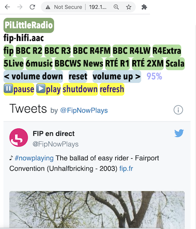

# PiLittleRadio
A Raspberry Pi internet radio controlled from a web page

## What it does
Turn an old Raspberry Pi and some amplified speakers into an internet radio you can control from your phone, tablet, Kindle or and computer on your WiFi network. It uses a simple webserver on the Pi to dish up a web page you can use to change channel, adjust the volume and see some 'now playing' track info via Twitter. The web page is designed to look good on a small iPhone but you could tweak it to look better on your device.

## What you'll need
- Some kind of Raspberry Pi with an audio jack and an SD card - I used a Raspberry Pi 3 Model B Rev 1.2 bu I think anything except a PiZero should work
- A way of connecting it to the internet, either ethernet or wifi -  you may need to add a USB WiFi dongle for older Pis if Ethernet is not an option
- Amplified speakers or headphones
- Some basic familiarity with command line Linux, editing HTML files and using a text editor like nano.
- An HDMI monitor and USB keyboard for initial set up
- A laptop with a terminal program is convenient but not essential to set it up remotely - you could do all the setup on the Pi itself. I describe using a laptop below but everything I do over SSH you can also do locally of course.
- That's it. This is not an audiophile project, it does not use an external DAC. In my view the 3.5mm jack is good enough for a radio in the kitchen, garage or workshop.

## How to install it

### Bake a fresh Pi
- Download a fresh copy of Raspberry Pi OS Lite, I used the current Buster image: https://www.raspberrypi.org/software/operating-systems/#raspberry-pi-os-32-bit 
- Flash it to the SD card - I used the 16GB microSD card that was in my old Pi using RaspberryPi imager app (Mac) but you could use a much smaller card.
- Plug the Pi into a TV or monitor via HDMI socket, add ethernet internet from your broadband router and a USB keyboard
- Wait for it to expand filesystem and run apt upgrade 
- log in as pi / raspberry
- configure a few things with sudo raspi-config:
-- set Wifi credentials
-- set audio to 3.5mm jack
-- change default Pi user password
-- Interface - enable SSH so you can administer from laptop
-- Change hostname: I used 'PiLittleRadio' to make it easier to find on your local network
- reboot Pi, sudo shutdown now
- unplug, replug
- Either use the HDMI monitor or `ifconfig` or look at your router admin page (e.g. BT Home Hub is http://192.168.1.254/) to see if it has successfully joined wifi, and get its IP address: this will be something like 192.168.1.199
- Log in by SSH from Terminal on your laptop: `ssh pi@192.168.1.199` in my case, enter password
- Hooray! You're now logged in to your Pi remotely!

### Install MPD and MPC
- Run `sudo apt-get update` on Pi
- Install Music Player Client and Daemon. These will stream internet radio for you.	Use `sudo apt-get install mpd mpc`

### Add some radio stations
- Add a radio station, for example fip, the greatest radio station in the world:
	`mpc add http://icecast.radiofrance.fr/fip-midfi.mp3`
- Test with `mpc play 1` - it should plays FIP out of the headphone socket.
- Add some more radio stations. You need the raw streaming URLs which can be found for most radio stations if you search the internet. My list looks like this:
	- BBC Radio 2 `mpc add http://bbcmedia.ic.llnwd.net/stream/bbcmedia_radio2_mf_p`
	- BBC Radio 3 `mpc add http://bbcmedia.ic.llnwd.net/stream/bbcmedia_radio3_mf_p`
	- BBC Radio 4 FM `mpc add http://bbcmedia.ic.llnwd.net/stream/bbcmedia_radio4fm_mf_p`
	- BBC Radio 5Live `mpc add http://bbcmedia.ic.llnwd.net/stream/bbcmedia_radio5live_mf_p`
	- BBC 6music `mpc add http://bbcmedia.ic.llnwd.net/stream/bbcmedia_6music_mf_p`
	- BBC World Service News stream `mpc add http://bbcwssc.ic.llnwd.net/stream/bbcwssc_mp1_ws-einws`
	- RTÉ Radio 1 `mpc add http://icecast2.rte.ie/radio1`
	- RTÉ 2XM `mpc add http://icecast2.rte.ie/2xm`
	- Scala Radio `mpc add https://stream-mz.planetradio.co.uk/scalahigh.aac`
	- BBC Radio 4 Extra `mpc add http://bbcmedia.ic.llnwd.net/stream/bbcmedia_radio4extra_mf_p`
	- BBC 6music high quality `mpc add http://a.files.bbci.co.uk/media/live/manifesto/audio/simulcast/hls/uk/sbr_high/ak/bbc_6music.m3u8`
	- BBC Radio 3 high quality `mpc add	http://a.files.bbci.co.uk/media/live/manifesto/audio/simulcast/hls/uk/sbr_high/ak/bbc_radio_three.m3u8`
	- fip high quality `mpc add http://icecast.radiofrance.fr/fip-hifi.aac`
- They will play by numbers in the order you add them, e.g. `mpc play 4` plays BBC Radio 4.

### Pump up the volume
- Edit the mpd.conf file on the Pi to enable volume changes to work with `sudo nano /etc/mpd.conf` 
- The audio_output section should end up looking like this:

```
audio_output {
        type            "alsa"
        name            "My ALSA Device"
        mixer_type      "software"   
}
```

- My audio jack audio was too quiet, so I fixed this using `alsamixer`.
- Press F6 to choose the audio device, select the headphones and turn the volume up. I went up to about 80%. Press ESC to escape.
- Test it out by playing some radio `mpc play 1` then try `mpc volume +10` or `mpc volume -10` to increase and decrease the volume.

### Install a webserver
- How do you install a webserver? You just install a webserver.
- Ok, there's a bit more to it. But not much more. There's a good guide to installing nginx, a lightweight webserver, here: https://www.raspberrypi.org/documentation/remote-access/web-server/nginx.md 
- In short, you need to type `sudo apt update` then install it with `sudo apt install nginx`
- Start the server with `sudo /etc/init.d/nginx start`
- On your laptop, browse to http://192.168.1.199 (replace that number with your Pi's IP address, or the name you gave the hostname, e.g. http://pilittleradio) and you should see the ‘welcome to nginx’ message served.
- The default web page is in /var/www/html on your Pi, and that's where we need to copy the index.php and shutdown.php files that form part of this project.

### Enable PHP
- The radio control webpage uses the PHP scripting language, so we need to enable it
- `sudo nano /etc/nginx/sites-enabled/default` to edit the file. find the line `index index.html index.htm;` roughly around line 25 (Press CTRL + C in nano to see the current line number). Add `index.php` after index to look like this:
```index index.php index.html index.htm;```
Scroll down until you find a section with the following content:
```
# pass the PHP scripts to FastCGI server listening on 127.0.0.1:9000
#
# location ~ \.php$ {
```

Edit by removing the # characters on the following lines:

```
location ~ \.php$ {
    include snippets/fastcgi-php.conf;
    fastcgi_pass unix:/var/run/php5-fpm.sock;
}
```

It should end up looking like this:
```
        # pass the PHP scripts to FastCGI server listening on 127.0.0.1:9000
        #
        location ~ \.php$ {
                include snippets/fastcgi-php.conf;

        # With php-fpm (or other unix sockets):
        fastcgi_pass unix:/var/run/php/php7.0-fpm.sock;
        # With php-cgi (or other tcp sockets):
    	# fastcgi_pass 127.0.0.1:9000;
        }
```

- Reload the configuration file with `sudo /etc/init.d/nginx reload`

- Now test PHP is working. Rename index.nginx-debian.html to index.php:
```
cd /var/www/html/
sudo mv index.nginx-debian.html index.php
```

- Open index.php with a text editor: `sudo nano index.php`

- Add some dynamic PHP content by replacing the current content with
```
<?php echo phpinfo(); ?>
```
Save and refresh your web browser. You should see a page with the PHP version, logo and current configuration settings.

### Add the web pages
- Rename the index page so it doesn't conflict with our radio controller page: `sudo mv index.php phpinfo.php` 
- Place the index.php and shutdown.php files from this project in your web server folder /var/www/html/ 
- If you've added a different set of radio stations, you'll need to edit the index.php file so the buttons have the right station names and plays the right station numbers. For example:
```
<a href="?station=4" class="stationlinks">BBC&nbsp;R4</a> 
```
has a button label of BBC R4 (the &nbsp; is a non-breaking space that ensures the button stays on one line), and it plays the 4th station added to MPC.
- I've added Twitter feeds of 'now playing' info for fip, BBC Radio 2, Radio 3, and 6Music. 
- Refresh your web-browser and you should see a page like this:



### Shutdown

You'll find that the shutdown option doesn't work unless you give the webserver's user permission to shut the system down. The nginx webserver runs as a user called www-data, so you need to use the `visudo` command like this:

`sudo visudo`

Add these lines to the bottom of the page:

```
pi ALL=(ALL) NOPASSWD: ALL
www-data ALL=/sbin/reboot
www-data ALL=NOPASSWD: /sbin/reboot
www-data ALL=/sbin/shutdown
www-data ALL=NOPASSWD: /sbin/shutdown
```

Press ctrl+x to save and exit.

When you click on 'shutdown' you'll be asked if you're sure and have the option to say no and go back to the radio control page. If you say yes you'll see a 'bad gateway' error in the browser, this is normal. Wait a bit before unplugging your Pi. Shutting down this way, rather than just pulling the power out, protects your SD card from getting corrupted. Probably.

### Background

I originally made this project in Cornwall in 2014: http://www.suppertime.co.uk/blogmywiki/2014/10/raspberry-pi-internet-radio-with-web-interface/

That version used a horrible kludge to get BBC Radio tracklistings via last.fm, but I think that doesn't work any more so I've stripped all that code (but not the CSS) out. It may be possible to do something clever with sydicated fip music info as per http://www.suppertime.co.uk/blogmywiki/2018/04/fip-now-plays/

### To do
- add delay on shutdown to avoid bad gateway error
- volume slider
- play local audio MP3 files 
- display station list on the fly and manage from web page
- make buttons stay lit when station selected
- add Bluetooth speaker option?
- make HTML and CSS responsive and just better all round really - it was all hacked together on holiday 6 years ago
